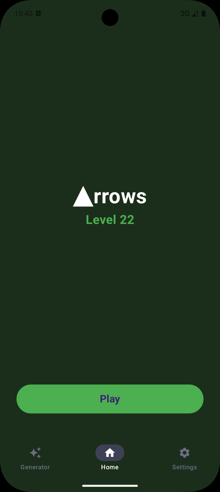
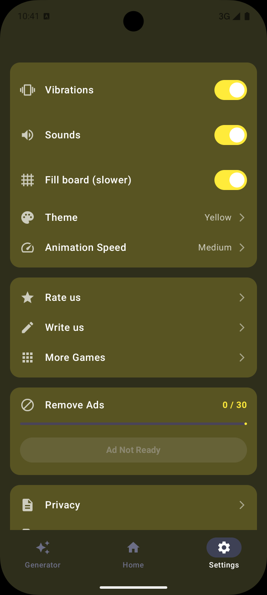
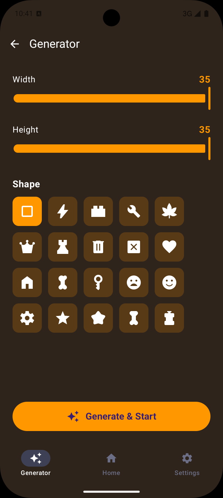
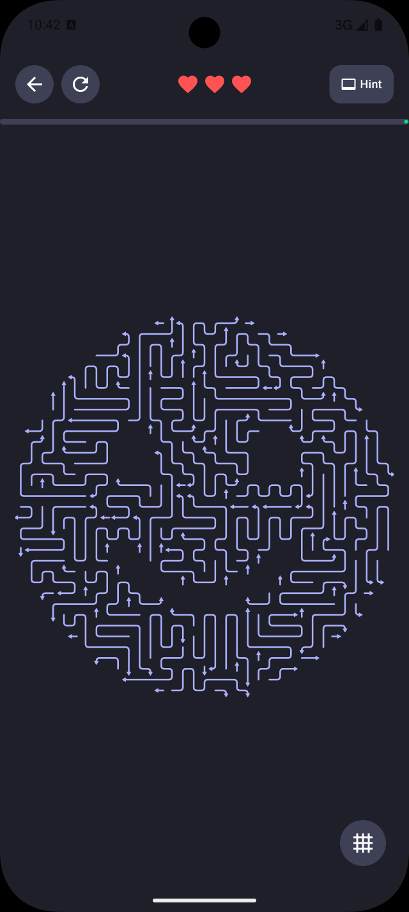

# Arrows Game (Android)

**Arrows Game** is a modular Android puzzle game inspired by *Arrows – Puzzle Escape*.

Google Play: https://play.google.com/store/apps/details?id=com.batodev.arrows

---

## Project Rationale

This project is an experiment in board generation: the main goal is to create a robust board generator for puzzle games, focusing on solvability and variety. The generator logic attempts to fill the board with "snakes" (arrow paths) while ensuring each level is solvable and interesting.

---

## Features

### Gameplay
- Procedural board generation with customizable shapes and sizes
- Solvability checker to ensure every generated board can be completed
- Multiple board shapes via `BoardShapeProvider`
- Dynamic level progression and difficulty scaling
- Touch-based gameplay with animated feedback
- Lives system with game-over recovery via rewarded ads
- Hint system (free when ad-free, otherwise rewarded-ad-gated)
- Pinch-to-zoom and pan on the game board
- Toggleable guidance lines overlay to help aim

### Win Celebration
- Full-screen celebration with fade-in/out video playback (26 videos)
- 10 randomized congratulatory messages
- Confetti particle animation

### Custom Level Generator
- Unlocked at level 20
- Adjustable board width and height
- Shape selection (rectangular or custom shapes)
- Fill-the-board mode for denser puzzles

### Settings & Customization
- 6 color themes: Dark, Green, Red, Yellow, Orange, Black and White
- 3 animation speed levels: High, Medium, Low
- Vibration and sound toggles

### Monetization
- Banner, rewarded, and interstitial ads
- Ad-free unlock by watching 30 rewarded ads (with progress bar)

### Localization
- 15 languages: English, Arabic, Bengali, German, Spanish, French, Hindi, Indonesian, Italian, Japanese, Polish, Portuguese, Russian, Urdu, Chinese

### Feedback & Legal
- In-app review (Rate Us), email support (Write Us), developer store link (More Games)
- Privacy policy link and third-party licenses dialog

### Debug
- Debug menu to force board dimensions, lives, and shapes

---

## Screenshots

   

---

## Architecture

The project follows **Clean Architecture** with **feature-based modularization** — 11 Gradle modules split across four layers.

```
┌─────────────────────────────────────────────────────┐
│                      :app                           │  Entry point
├─────────────────────────────────────────────────────┤
│                  :navigation                        │  Navigation layer (Appyx)
├──────────────┬──────────────┬──────────────┬────────┤
│ :feature:home│ :feature:game│:feature:gen..│:feat.. │  Feature layer
├──────────────┴──────────────┴──────────────┴────────┤
│          :core:ui              :ads                 │  Presentation / shared
├─────────────────────────────────────────────────────┤
│                    :domain                          │  Business logic (pure Kotlin)
├──────────────────────────┬──────────────────────────┤
│           :data          │      :core:models        │  Data / models
├──────────────────────────┴──────────────────────────┤
│                  :core:resources                    │  Android resources
└─────────────────────────────────────────────────────┘
```

**Dependency rule:** inner layers know nothing about outer layers. `:domain` and `:core:models` have zero Android dependencies.

---

## Dependency Injection (Koin)

The project uses **Koin** for dependency injection, allowing for a decoupled and testable architecture across its modular structure.

### How it works
1. **Centralized Initialization**: Koin is started in `ArrowsApplication` using `startKoin`, where the Android context is provided and all modules are loaded.
2. **Modular Definitions**: Each layer/feature defines its own Koin module (e.g., `dataModule`, `adsModule`, `viewModelModule`), keeping dependencies close to where they are used.
3. **Injection**:
    - **Appyx Nodes**: Implement `KoinComponent` to use `by inject()` for retrieving dependencies that aren't passed via constructors.
    - **ViewModels**: Defined using Koin's `viewModel` DSL and injected into Composables or Activities.
    - **Singletons**: Used for repositories, database instances, and ad managers.

### Dependencies
| Library | Artifact | Version |
|---------|----------|---------|
| Koin Android | `io.insert-koin:koin-android` | 4.0.0 |
| Koin Compose | `io.insert-koin:koin-androidx-compose` | 4.0.0 |

---

## Modules

### `:app`
**Entry point.** Single `Activity` + `Application` class.

| File | Purpose |
|------|---------|
| `MainActivity.kt` | Hosts the Appyx `RootNode`, applies the theme |
| `ArrowsApplication.kt` | Initializes Koin, Room DB, repositories, and ad managers |

---

### `:navigation`
**Navigation layer** built on [Appyx](https://bumble-tech.github.io/appyx/) 1.7.1.

| File | Purpose |
|------|---------|
| `NavTarget.kt` | Sealed class of all navigation destinations |
| `RootNode.kt` | `ParentNode` that owns `BackStack<NavTarget>` and resolves each target to a child `Node` |
| `transitions/NavTransitions.kt` | Defines 5 transition types (FADE, SLIDE_H, SLIDE_V, SCALE_FADE, ROTATE_FADE) |
| `transitions/RandomTransitionHandler.kt` | Picks a random transition on each navigation event |

Navigation state is a typed Kotlin object — fully testable without a UI (`BackStackNavigationTest`).

```
RootNode                    ← ParentNode, owns BackStack<NavTarget>
 ├── HomeNode               ← renders HomeScreen
 ├── GameNode               ← renders GameScreen
 ├── GenerateNode           ← renders GenerateScreen
 └── SettingsNode           ← renders SettingsScreen
```

---

### `:feature:home`
**Landing screen.** Displays the current level, lives, and the Play button.

| File | Purpose |
|------|---------|
| `HomeScreen.kt` | Main UI composable |
| `HomeNode.kt` | Appyx `Node` wrapping the screen |
| `AppViewModel.kt` | App-wide `StateFlow` state: theme, sounds, vibration, level, lives, debug flags |

`AppViewModel` is managed by Koin and acts as the single source of truth for user preferences.

---

### `:feature:game`
**Core gameplay.** The largest and most complex module.

| File | Purpose |
|------|---------|
| `GameScreen.kt` | Root game composable |
| `GameNode.kt` | Appyx `Node` for the game screen (uses `KoinComponent` for injection) |
| `engine/GameEngine.kt` | ViewModel: board state, lives, level progression, input routing |
| `engine/LevelManager.kt` | Level generation, difficulty scaling, shape selection |
| `engine/InputHandler.kt` | Maps touch coordinates to board cells |
| `engine/TapHandler.kt` | Tap animations, snake flash, removal feedback |
| `engine/TransformationState.kt` | Zoom/pan state (scale + offset) |
| `engine/RemovalAnimator.kt` | Timing for snake removal animation sequences |
| `ArrowsBoardRenderer.kt` | Canvas-based composable rendering snakes, arrows, guidance lines |
| `ui/game/WinCelebrationScreen.kt` | Video playback + confetti + message on win |
| `ui/game/IntroOverlay.kt` | First-run tutorial overlay |
| `SoundManager.kt` | Plays tap / win audio |

Test coverage: `GameEngineTapTest`, `GameEngineShapeLogicTest`, `CustomGameShapeTest`, and more.

---

### `:feature:generate`
**Custom level builder.** Unlocked at level 20. Lets players configure and play their own boards.

| File | Purpose |
|------|---------|
| `GenerateScreen.kt` | UI: width/height sliders, shape picker, fill-board toggle |
| `GenerateNode.kt` | Appyx `Node` wrapping the screen |

---

### `:feature:settings`
**Settings screen.** User preferences, monetization controls, debug tools.

| File | Purpose |
|------|---------|
| `SettingsScreen.kt` | Theme, animation speed, sound/vibration toggles |
| `SettingsNode.kt` | Appyx `Node` wrapping the screen (uses `KoinComponent` for injection) |
| `AdSettingsSection.kt` | Ad-free unlock UI (progress bar, "watch 30 ads") |
| `ThirdPartyLicensesDialog.kt` | Open-source license browser (aboutlibraries) |
| `DebugComponents.kt` | Debug menu: force dimensions, lives, shapes |

---

### `:core:ui`
**Shared UI.** Theme, components, and styling consumed by all feature modules.

| File | Purpose |
|------|---------|
| `theme/ThemeColors.kt` | 6 named color themes |
| `theme/Type.kt` | Typography definitions |
| `AppNavigationBar.kt` | Bottom navigation bar composable |
| `SettingsBaseComponents.kt` | Reusable settings-row components |

---

### `:core:models`
**Pure Kotlin models.** No Android dependencies — can run on the JVM alone.

| File | Purpose |
|------|---------|
| `GameConstants.kt` | 160+ constants covering mechanics, animations, UI sizes, progression, ads |
| `CustomGameParams.kt` | Parameters for a custom game (width, height, shape, fill mode) |
| `engine/GameModels.kt` | `Point`, `Direction`, `Snake`, `GameLevel` data classes |
| `engine/BoardShapeProvider.kt` | Interface for retrieving board shapes |
| `engine/ParameterObjects.kt` | `GenerationParams`, `GenerationContext`, and related value objects |

---

### `:core:resources`
**Android resources only.** No Kotlin/Java code — just strings, colors, drawables, and dimensions shared across all modules.

---

### `:domain`
**Business logic.** Pure Kotlin, no Android dependencies — fully unit-testable.

| File | Purpose |
|------|---------|
| `GameGenerator.kt` | Frontier-based snake placement algorithm — the heart of the project |
| `SnakeBuilder.kt` | Builds snake paths on the board |
| `SolvabilityChecker.kt` | Validates that a generated board is completable |
| `LevelProgression.kt` | Maps level number to difficulty parameters |
| `GenerationUtils.kt` | Line-of-sight checks, cell validation helpers |
| `BoardImageProcessor.kt` | Reads custom board shapes from image pixel data |

---

### `:data`
**Data layer.** Room database, repositories, and persistence utilities.

| File | Purpose |
|------|---------|
| `AppDatabase.kt` | Room DB (schema v2), single source of truth for all persistence |
| `UserPreferencesEntity.kt` | Wide preferences table (theme, sounds, level, lives, ad-free, etc.) |
| `UserPreferencesDao.kt` | 17 targeted update methods + `Flow` observables |
| `UserPreferencesRepository.kt` | Repository wrapping the DAO; implements `IUserPreferencesRepository` |
| `GameBoardEntity.kt` / `SnakeEntity.kt` / `SnakeBodyPointEntity.kt` | Normalized game board persistence |
| `GameStateDao.kt` | DAO for saving/loading the last board (resume support) |
| `ShapeRegistry.kt` | Custom shape storage |
| `AndroidResourceBoardShapeProvider.kt` | `BoardShapeProvider` backed by Android resources |
| `DataStoreMigration.kt` | One-time migration from DataStore preferences to Room |

---

### `:ads`
**Monetization.** Google Mobile Ads integration and GDPR consent.

| File | Purpose |
|------|---------|
| `RewardAdManager.kt` | Rewarded ad lifecycle: load, show, callbacks |
| `InterstitialAdManager.kt` | Interstitial lifecycle (shown every 5 games) |
| `ConsentManager.kt` | Google UMP consent flow (GDPR / regional) |
| `BannerAdView.kt` | Composable banner ad |

---

## Tech Stack

| Layer | Technology |
|-------|-----------|
| Language | Kotlin 2.3.10 (JVM 11) |
| UI | Jetpack Compose (BOM 2026.02.00), Material 3 |
| Navigation | Appyx 1.7.1 |
| Dependency Injection | Koin 4.0.0 |
| Database | Room 2.8.4 |
| Ads | Google Mobile Ads 25.0.0, UMP 4.0.0 |
| Concurrency | kotlinx-coroutines 1.10.2 |
| Testing | JUnit 4, Mockito 5, Appyx testing |
| Static analysis | Detekt 2.0.0-alpha.2 |
| Code coverage | Jacoco 0.8.13 |
| Code generation | KSP 2.3.6 (Room compiler) |
| Celebrations | Konfetti 2.0.5 (confetti) |
| Licenses UI | AboutLibraries 14.0.0-b02 |

**Android SDK:** minSdk 29 (Android 10) · compileSdk 36 (Android 15)
**App version:** 1.7 (version code 8)
**Application ID:** `com.batodev.arrows`

---

## Build

```bash
# Run tests, lint, and static analysis
./gradlew test lint detekt

# Generate Jacoco coverage report
./gradlew testDebugUnitTestCoverage
```

---

*This project is a playground for board generation algorithms. Feedback and contributions are welcome!*

YourKit supports open source projects with innovative and intelligent tools
for monitoring and profiling Java and .NET applications.
YourKit is the creator of <a href="https://www.yourkit.com/java/profiler/">YourKit Java Profiler</a>,
<a href="https://www.yourkit.com/dotnet-profiler/">YourKit .NET Profiler</a>,
and <a href="https://www.yourkit.com/youmonitor/">YourKit YouMonitor</a>.
